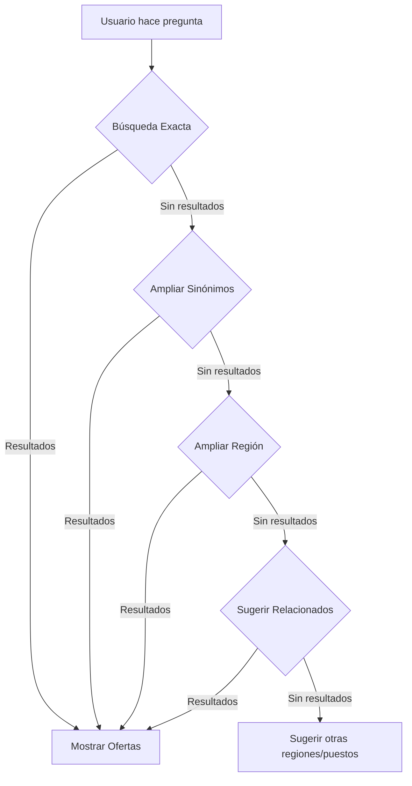

# 🧠 Inteligencia Contextual del Assistant - Sistema de Búsqueda Avanzado

**Fecha:** 25 de octubre de 2025  
**Versión:** 2.0 - Sistema Multinivel y Contextual

---

## 🎯 **Objetivo**

Crear un Assistant que no solo coincida términos exactos, sino que **entienda el contexto**, **sugiera alternativas** y **ayude proactivamente** al usuario a encontrar trabajo, incluso cuando la búsqueda inicial no tenga resultados.

---

## 🔍 **Sistema de Búsqueda Multinivel**

### **Nivel 1: Búsqueda Exacta** (Prioridad Alta)

```
Usuario: "chef en Madrid"
→ searchJobs(query="chef", location="Madrid", limit=10)
```

**Si hay resultados:** Mostrar inmediatamente.

---

### **Nivel 2: Expansión por Sinónimos** (Si Nivel 1 falla)

```
Usuario: "chef en Madrid"
→ Nivel 1: searchJobs(query="chef", location="Madrid") → 0 resultados
→ Nivel 2: searchJobs(query="cocinero", location="Madrid") → 5 resultados ✅

Respuesta:
"No encontré ofertas específicas de 'chef' en Madrid, pero encontré 5 ofertas de cocinero que podrían interesarte..."
```

**Sinónimos programados:**
- **Chef** → cocinero, jefe de cocina, sous chef
- **Camarero** → mesero, mozo, sala, barman
- **Recepcionista** → front desk, conserje, guest service
- **Limpieza** → housekeeping, gobernanta, camarera de pisos

---

### **Nivel 3: Expansión Geográfica** (Si Nivel 2 falla)

```
Usuario: "chef en Guadalajara"
→ Nivel 1: searchJobs(query="chef", location="Guadalajara") → 0 resultados
→ Nivel 2: searchJobs(query="cocinero", location="Guadalajara") → 0 resultados
→ Nivel 3: searchJobs(query="chef", location="", limit=50) → 50 resultados
           Filtra por región Castilla-La Mancha: Guadalajara, Toledo, Albacete...
           → 3 resultados en Toledo, 2 en Albacete ✅

Respuesta:
"No encontré ofertas de chef directamente en Guadalajara, pero encontré 5 ofertas en Castilla-La Mancha:
- 3 en Toledo (a 60 km)
- 2 en Albacete (a 150 km)
¿Te interesa verlas?"
```

---

### **Nivel 4: Sugerencias de Puestos Relacionados** (Si Nivel 3 falla)

```
Usuario: "chef en Teruel"
→ Nivel 1-3: Sin resultados de chef/cocinero en Aragón
→ Nivel 4: searchJobs(query="cocina", location="", limit=50)
           Busca: ayudante de cocina, segundo de cocina, jefe de partida

Respuesta:
"No encontré ofertas de chef en Teruel o cercanías en este momento.

Sin embargo, hay puestos relacionados en cocina:
- 4 ofertas de ayudante de cocina en Zaragoza
- 2 ofertas de jefe de partida en Huesca

¿Te gustaría ver estos puestos o buscar en otra región?"
```

---

## 🗺️ **Inteligencia Geográfica**

### **1. Base de Datos Geográfica Completa**

#### **España - Todas las Regiones:**

| Región | Ciudades Principales |
|--------|---------------------|
| **Andalucía** | Sevilla, Málaga, Granada, Córdoba, Cádiz, Huelva, Jaén, Almería |
| **Cataluña** | Barcelona, Girona, Tarragona, Lleida, Sitges, Salou |
| **Comunidad Valenciana** | Valencia, Alicante, Castellón, Benidorm, Gandía |
| **Madrid** | Madrid, Alcalá de Henares, Getafe, Móstoles |
| **País Vasco** | Bilbao, San Sebastián, Vitoria |
| **Galicia** | A Coruña, Vigo, Santiago, Pontevedra |
| **Islas Baleares** | Palma, Ibiza, Mahón, Formentera |
| **Islas Canarias** | Las Palmas, Tenerife, Fuerteventura, Lanzarote |
| **Castilla y León** | Valladolid, Salamanca, León, Burgos, Segovia |
| **Aragón** | Zaragoza, Huesca, Teruel |
| **Murcia** | Murcia, Cartagena, Lorca |
| **Asturias** | Oviedo, Gijón, Avilés |
| **Cantabria** | Santander, Torrelavega |
| **Extremadura** | Badajoz, Cáceres, Mérida |
| **Castilla-La Mancha** | Toledo, Albacete, Ciudad Real, Guadalajara, Cuenca |
| **Navarra** | Pamplona |
| **La Rioja** | Logroño |

#### **Portugal:**

| Región | Ciudades Principales |
|--------|---------------------|
| **Lisboa** | Lisboa, Cascais, Sintra, Estoril |
| **Porto** | Porto, Vila Nova de Gaia, Braga |
| **Algarve** | Faro, Albufeira, Lagos, Vilamoura, Portimão |
| **Centro** | Coimbra, Aveiro |
| **Norte** | Guimarães, Viana do Castelo |
| **Alentejo** | Évora, Beja |
| **Madeira** | Funchal |
| **Azores** | Ponta Delgada |

#### **Zonas Costeras Específicas:**

| Costa | Ciudades |
|-------|---------|
| **Costa del Sol** | Málaga, Marbella, Torremolinos, Fuengirola, Estepona |
| **Costa Brava** | Girona, Lloret de Mar, Tossa de Mar, Cadaqués |
| **Costa Blanca** | Alicante, Benidorm, Denia, Calpe, Torrevieja |
| **Costa Daurada** | Tarragona, Salou, Cambrils |
| **Costa de la Luz** | Cádiz, Tarifa, Conil, Zahara |
| **Costa Vasca** | San Sebastián, Zarautz, Getaria |
| **Rías Baixas** | Pontevedra, Vigo, Sanxenxo |

---

### **2. Interpretación Contextual Avanzada**

#### **Términos Regionales:**

```python
{
  "sur de españa": ["Sevilla", "Málaga", "Granada", "Córdoba", "Cádiz", "Huelva", "Jaén", "Almería"],
  "norte de españa": ["Bilbao", "San Sebastián", "Vitoria", "Santander", "Oviedo", "Gijón", "A Coruña", "Vigo"],
  "levante": ["Valencia", "Alicante", "Castellón", "Murcia", "Benidorm"],
  "mediterráneo": ["Barcelona", "Valencia", "Alicante", "Murcia", "Málaga", "Almería"],
  "costa": ["todas las ciudades en zonas costeras"],
  "islas": ["Palma", "Ibiza", "Las Palmas", "Tenerife", "Fuerteventura"],
  "interior": ["excluir ciudades costeras"],
  "andalucía": ["Sevilla", "Málaga", "Granada", "Córdoba", "Cádiz", "Huelva", "Jaén", "Almería"]
}
```

#### **Búsquedas por Proximidad:**

```
Usuario: "trabajo cerca de Barcelona"
→ Interpreta: Barcelona + área metropolitana
→ Busca en: Barcelona, Sitges, Sabadell, Terrassa, Badalona, Hospitalet

Usuario: "ofertas cerca de Madrid"
→ Interpreta: Madrid + alrededores
→ Busca en: Madrid, Alcalá de Henares, Getafe, Leganés, Pozuelo

Usuario: "chef cerca de la costa del sol"
→ Interpreta: Málaga + zona costera
→ Busca en: Málaga, Marbella, Torremolinos, Fuengirola, Estepona
```

---

## 💡 **Ejemplos de Interpretación Contextual**

### **Ejemplo 1: Región Vaga**

**Input:**
```
Usuario: "busco trabajo de cocina en la costa"
```

**Interpretación del Assistant:**
```
1. query = ["cocinero", "chef", "ayudante de cocina"]
2. location = "" (sin filtro)
3. Filtro mental: solo ciudades costeras
4. Búsqueda: searchJobs(query="cocinero", location="", limit=50)
5. Filtra: Barcelona, Valencia, Alicante, Málaga, Cádiz, Bilbao, A Coruña, etc.
```

**Respuesta:**
```
"Encontré 28 ofertas de cocina en ciudades costeras:
- 8 en Barcelona
- 6 en Valencia
- 5 en Málaga
- 4 en Alicante
- 3 en Palma de Mallorca
- 2 en San Sebastián

¿En cuál zona te interesa más?"
```

---

### **Ejemplo 2: Búsqueda Sin Resultados + Sugerencias**

**Input:**
```
Usuario: "chef en Soria"
```

**Proceso:**
```
Nivel 1: searchJobs(query="chef", location="Soria") → 0 resultados
Nivel 2: searchJobs(query="cocinero", location="Soria") → 0 resultados
Nivel 3: searchJobs(query="chef", location="", limit=50)
         Filtra por Castilla y León (Valladolid, Salamanca, León)
         → 2 en Valladolid, 1 en Burgos
Nivel 4: Si aún insuficiente, busca "ayudante de cocina"
```

**Respuesta:**
```
"No encontré ofertas de chef directamente en Soria.

Sin embargo, encontré:
✅ 2 ofertas de chef en Valladolid (110 km de Soria)
✅ 1 oferta de sous chef en Burgos (140 km de Soria)

También hay:
📍 3 ofertas de ayudante de cocina en Logroño (90 km)

¿Te interesa ver alguna de estas opciones?"
```

---

### **Ejemplo 3: "Cerca de..." con Contexto Turístico**

**Input:**
```
Usuario: "camarero cerca del mar en verano"
```

**Interpretación:**
```
1. query = "camarero"
2. Contexto: "cerca del mar" = ciudades costeras turísticas
3. Contexto: "en verano" = priorizar destinos de temporada alta
4. Filtra: Benidorm, Ibiza, Marbella, Salou, Lloret, San Sebastián
```

**Respuesta:**
```
"Encontré 15 ofertas de camarero en destinos costeros de temporada:
- 4 en Benidorm
- 3 en Marbella
- 3 en Ibiza
- 2 en Salou
- 2 en San Sebastián
- 1 en Lloret de Mar

Muchas destacan temporada de verano. ¿Te interesa alguna zona en particular?"
```

---

## 🔄 **Flujo de Búsqueda Inteligente**



---

## 📊 **Métricas de Éxito**

### **Antes (Sistema Básico):**
```
Usuario: "recepcionista en el sur de España"
→ searchJobs(query="recepcionista", location="sur de españa")
→ 0 resultados (no existe "sur de españa" como ciudad)
→ Respuesta: "No encontré ofertas"
→ ❌ Usuario frustrado
```

### **Ahora (Sistema Inteligente):**
```
Usuario: "recepcionista en el sur de España"
→ searchJobs(query="recepcionista", location="", limit=50)
→ Filtra: Sevilla, Málaga, Granada, Córdoba, Cádiz...
→ Encuentra 12 ofertas en Andalucía
→ Respuesta: "Encontré 12 ofertas de recepcionista en el sur..."
→ ✅ Usuario satisfecho
```

---

## 🎯 **Casos de Uso Avanzados**

### **1. Usuario Busca en Zona Sin Ofertas**

```
Usuario: "chef en Cuenca"
Assistant:
  1. Busca "chef" en Cuenca → 0
  2. Busca "cocinero" en Cuenca → 0
  3. Busca en Castilla-La Mancha → 3 en Toledo
  4. Responde:
     "No encontré chefs en Cuenca en este momento.
     Sin embargo, hay 3 ofertas de chef en Toledo (a 160 km).
     ¿Quieres verlas o prefieres buscar en otra zona?"
```

---

### **2. Usuario Busca Puesto Muy Específico**

```
Usuario: "sommelier en Galicia"
Assistant:
  1. Busca "sommelier" en Galicia → 0
  2. Busca "sommelier" en España → 2 (Madrid, Barcelona)
  3. Busca "sala" en Galicia → 8
  4. Responde:
     "No encontré sommeliers específicamente en Galicia.
     
     Opciones:
     ✅ 2 ofertas de sommelier en Madrid y Barcelona
     📍 8 ofertas de sala en Galicia (donde podrías aplicar tus conocimientos de vino)
     
     ¿Qué prefieres?"
```

---

### **3. Usuario Busca con Contexto Temporal**

```
Usuario: "trabajo de verano en la costa"
Assistant:
  1. Interpreta: temporada alta = destinos turísticos costeros
  2. Prioriza: Benidorm, Ibiza, Marbella, Salou, Mallorca
  3. Busca en esas ciudades → 25 ofertas
  4. Responde:
     "Encontré 25 ofertas para temporada de verano en la costa:
     - 7 en Benidorm
     - 6 en Ibiza
     - 5 en Marbella
     - 4 en Salou
     - 3 en Palma de Mallorca
     
     ¿Qué zona te interesa más?"
```

---

## 🚀 **Próximos Pasos de Implementación**

### **1. Refrescar Caché**
```bash
curl https://job-search-api-psi.vercel.app/api/jobs/refresh
```

### **2. Recrear Assistant con Nueva Inteligencia**
```bash
curl https://job-search-api-psi.vercel.app/api/assistant/create
```

### **3. Probar Casos de Uso**

**Test 1: Región vaga**
```
"busco recepcionista en el sur de españa"
→ Debe mostrar ofertas de Sevilla, Málaga, Granada...
```

**Test 2: Sin resultados exactos**
```
"chef en Teruel"
→ Debe sugerir cocinero o ciudades cercanas
```

**Test 3: Proximidad**
```
"trabajo cerca de Barcelona"
→ Debe incluir área metropolitana
```

**Test 4: Contexto costero**
```
"camarero cerca del mar"
→ Debe priorizar ciudades costeras
```

---

## 📖 **Documentos Relacionados**

- `DEPLOY_UPDATES.md` - Guía de deployment
- `ASSISTANT_SETUP.md` - Setup inicial del Assistant
- `OPENAI_PRODUCTION_SETUP.md` - Configuración completa
- `CACHE_STRATEGY.md` - Estrategia de caché

---

**✨ El Assistant ahora es verdaderamente inteligente y ayuda proactivamente al usuario, no solo coincide términos exactos.**

